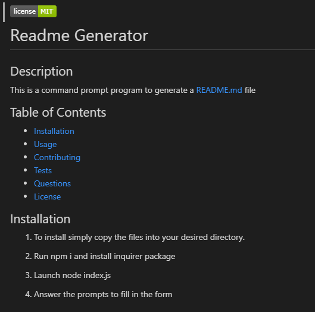
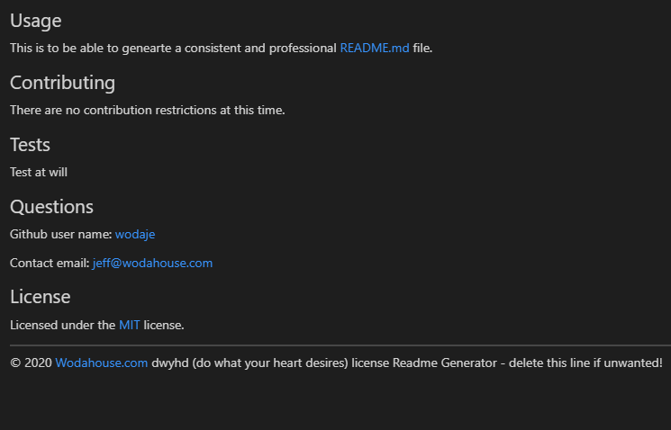

 

---
# Readme Generator

## Description 
This is a command prompt program to generate a README.md file

## Table of Contents

* [Installation](#Installation)
* [Usage](#Usage)
* [Contributing](#Contributing)
* [Tests](#Tests)
* [Questions](#Questions)
* [License](#License)

## Installation

1.	To install simply copy the files into your desired directory.

2.	Run npm i and install inquirer package

3. 	Launch node index.js

4.	Answer the prompts to fill in the form

5.  Instructional [Video](ins_vid.mp4) 

    _**(Due to file size restrictions please click on raw file and download the video as GitHub will not autoplay)**_

## Usage 

This is to be able to genearte a consistent and professional README.md file.

## Contributing

There are no contribution restrictions at this time.

## Tests

Test at will

## Questions

Github user name: [wodaje](https://github.com/wodaje)

Contact email: [jeff@wodahouse.com](mailto:jeff@wodahouse.com)

## License

Licensed under the [MIT](MIT%20License.txt) license.

---

© 2020 Wodahouse.com dwyhd (do what your heart desires) license Readme Generator - delete this line if unwanted!